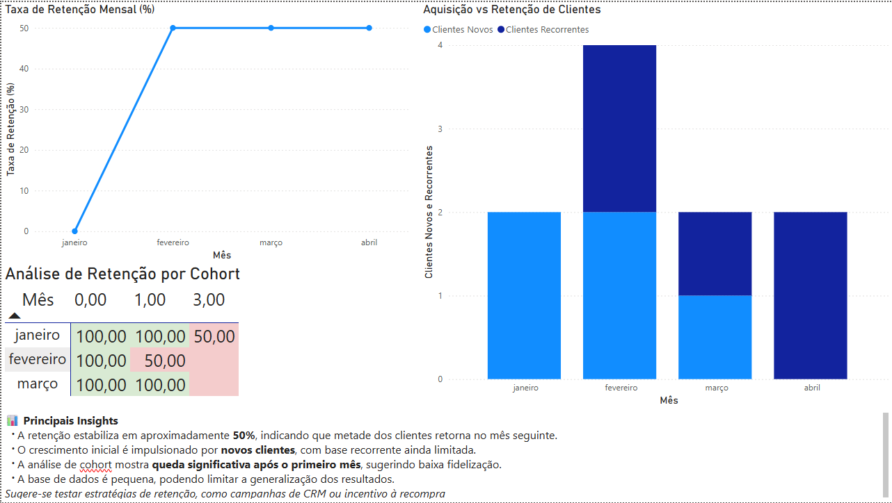

# 📊 Análise de Retenção de Clientes



Este projeto tem como objetivo analisar o comportamento de retenção de clientes ao longo do tempo, identificando padrões de recompra e oportunidades de melhoria na fidelização.

---

## 🎯 Objetivo

Avaliar a retenção de clientes mês a mês, distinguindo entre novos e recorrentes, além de identificar padrões de churn através de análise de cohort.

---

## 📊 Visão do Dashboard

O dashboard foi desenvolvido no Power BI e apresenta:

* 📈 Taxa de retenção mensal
* 📊 Aquisição vs retenção de clientes
* 🔥 Análise de cohort (retenção ao longo do tempo)
* 🧠 Insights estratégicos

---

## 📌 Principais Insights

* A taxa de retenção estabiliza em aproximadamente **50%**, indicando que metade dos clientes retorna no mês seguinte.
* O crescimento inicial da base é impulsionado por **novos clientes**, com baixa recorrência inicial.
* A análise de cohort evidencia uma **queda acentuada após o primeiro ciclo de retenção**, sugerindo desafios na fidelização.
* O volume de dados é limitado, podendo impactar a robustez das conclusões.

💡 **Recomendação:** implementar estratégias de retenção como campanhas de CRM e incentivos à recompra.

---

## 🛠️ Tecnologias Utilizadas

* SQL (PostgreSQL)
* Power BI
* Modelagem de dados
* Git & GitHub

---

## 🗂️ Estrutura do Projeto

```text
customer-retention-cohort-analysis/
│
├── assets/
│   └── dashboard.png
│
├── dashboard/
│   └── powerbi_dashboard.pbix
│
├── data/
│   └── raw/
│       └── insert_data.sql
│
├── insights/
│   └── principais_insights.md
│
├── queries/
│   ├── 01_base_clientes_mensal.sql
│   ├── 02_primeira_compra_clientes.sql
│   ├── 03_novos_vs_recorrentes.sql
│   ├── 04_retencao_mensal.sql
│   ├── 05_churn_mensal.sql
│   └── 06_cohort_retencao.sql
│
├── schema/
│   └── create_tables.sql
│
├── views/
│   ├── 01_vw_primeira_compra_cliente.sql
│   ├── 02_vw_novos_vs_recorrentes.sql
│   ├── 03_vw_retencao_mensal.sql
│   ├── 04_vw_churn_mensal.sql
│   └── 05_vw_cohort_retencao.sql
│
└── README.md
```

---

## 🔄 Processo de Análise

1. Criação das tabelas e carga de dados
2. Construção de queries para análise de comportamento
3. Criação de views para organização e reutilização das métricas
4. Cálculo de indicadores:

   * Retenção
   * Churn
   * Clientes novos vs recorrentes
5. Construção da análise de cohort
6. Visualização no Power BI

---

## 📈 Métricas Analisadas

* Taxa de retenção mensal
* Taxa de churn
* Clientes novos vs recorrentes
* Retenção por cohort

---

## 🚀 Possíveis Melhorias

* Aumentar volume de dados para maior confiabilidade
* Incluir segmentação por perfil de cliente
* Analisar impacto de campanhas de marketing
* Criar modelos preditivos de churn

---

## 👩‍💻 Autor

**Larissa Lima**
📍 Brasil
🎯 Em transição para Analista de BI

---
